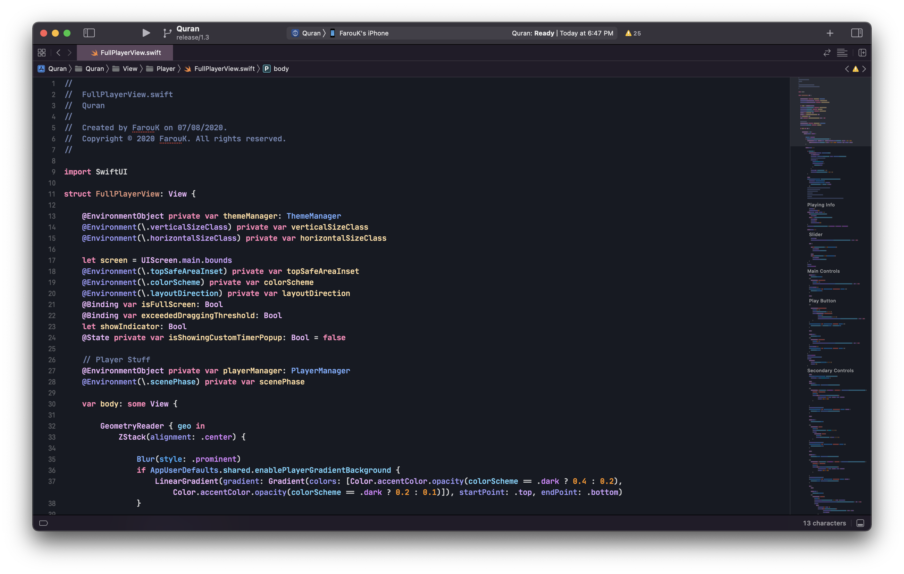
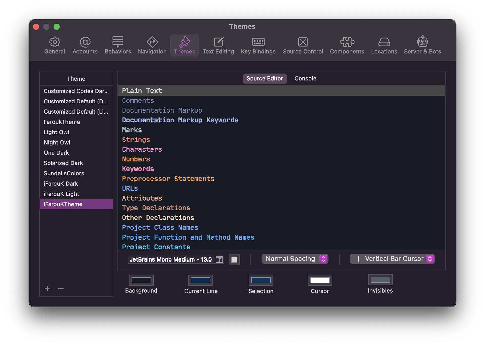

# 🎨 My Xcode theme - iFarouK Theme



## Installing 

1. Clone this repo:
```
$ git clone https://github.com/FaroukZeino/iFarouKXcodeTheme.git
```

2. Create a folder at this path if it doesn't exist already:
###### Tip: You can copy the path then open Finder after that press ⌘ + ⇧ + G
```
~/Library/Developer/Xcode/UserData/FontAndColorThemes
```

3. Copy the file `iFarouKTheme.xccolortheme` into the above folder.

4. Download the latest release of JetBrainsMono from [its official website](https://www.jetbrains.com/lp/mono/).

5. Unzip the font archive and move the files in the `TTF` folder to `~/Library/Fonts`.

6. It's yours now. 🥳



## Attributions

The colors of this theme are created by me.

